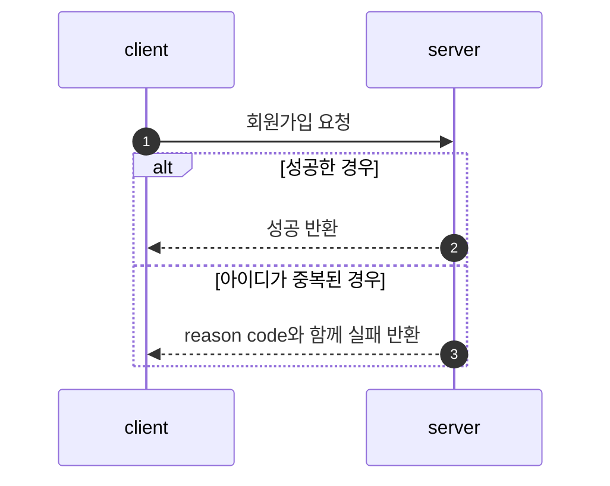
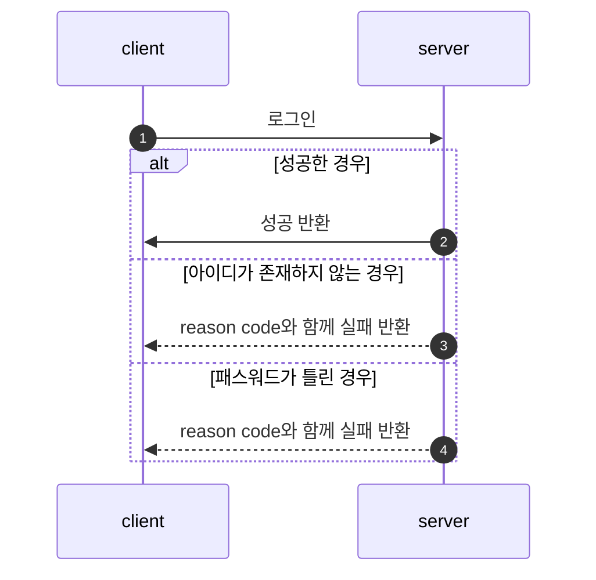
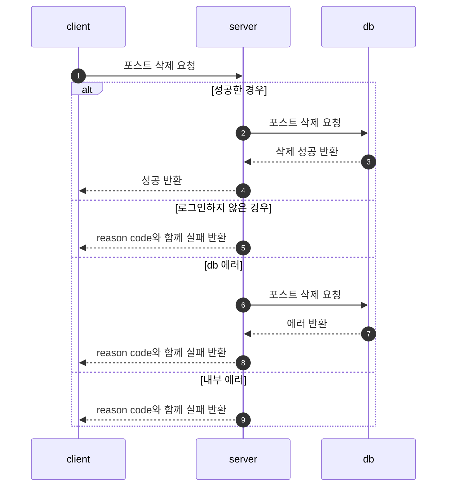
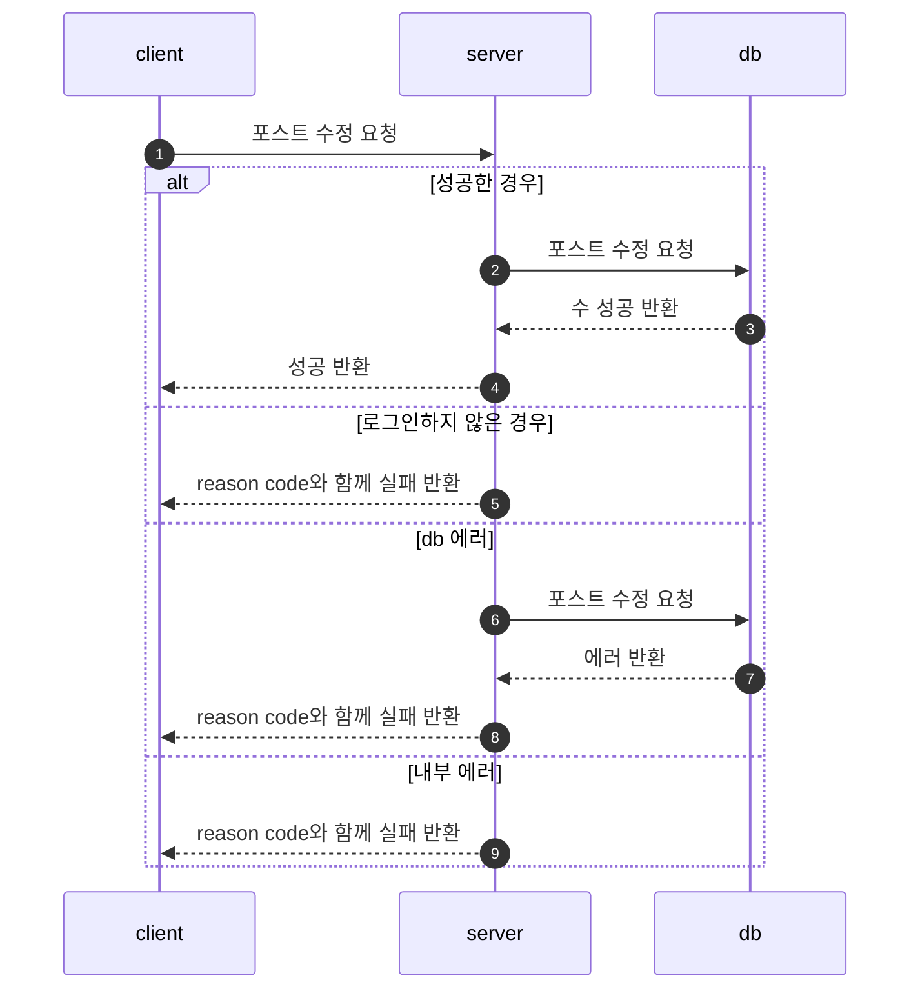
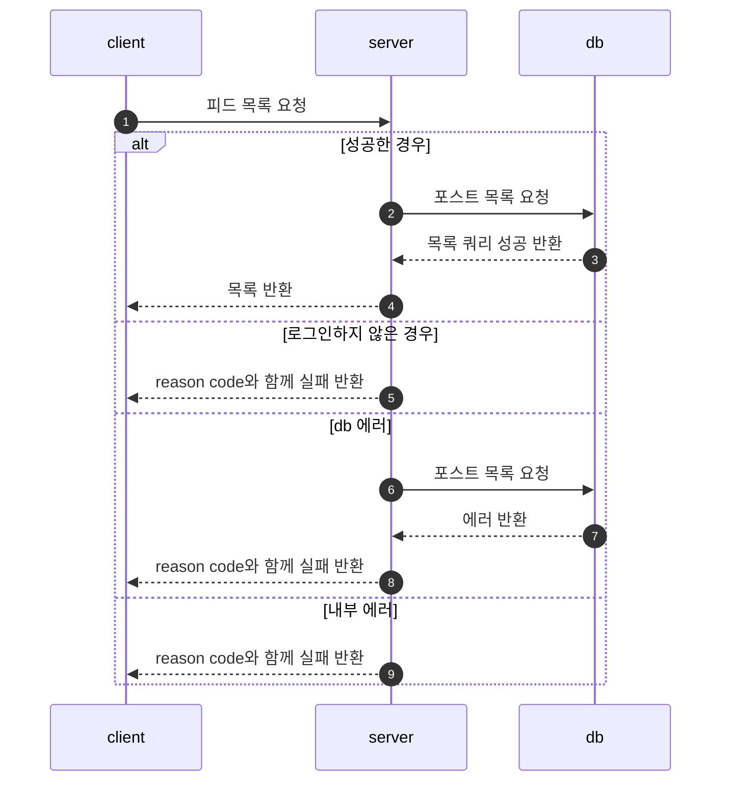
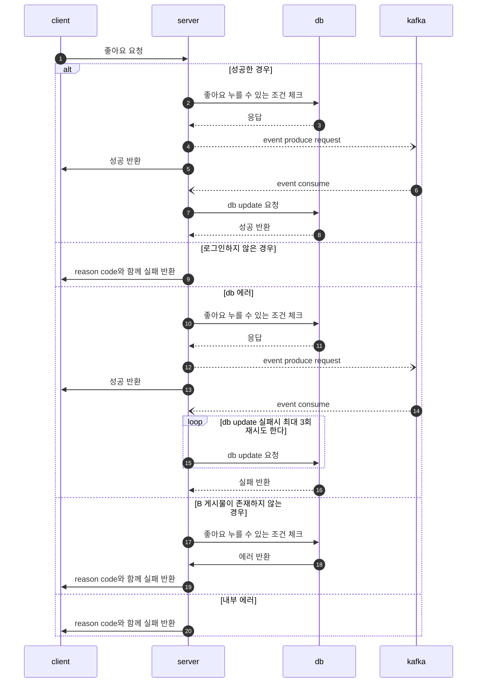
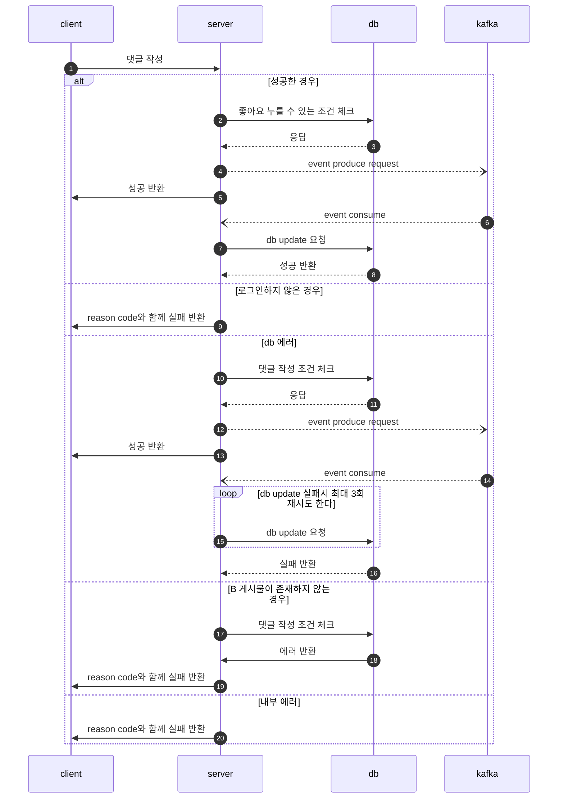
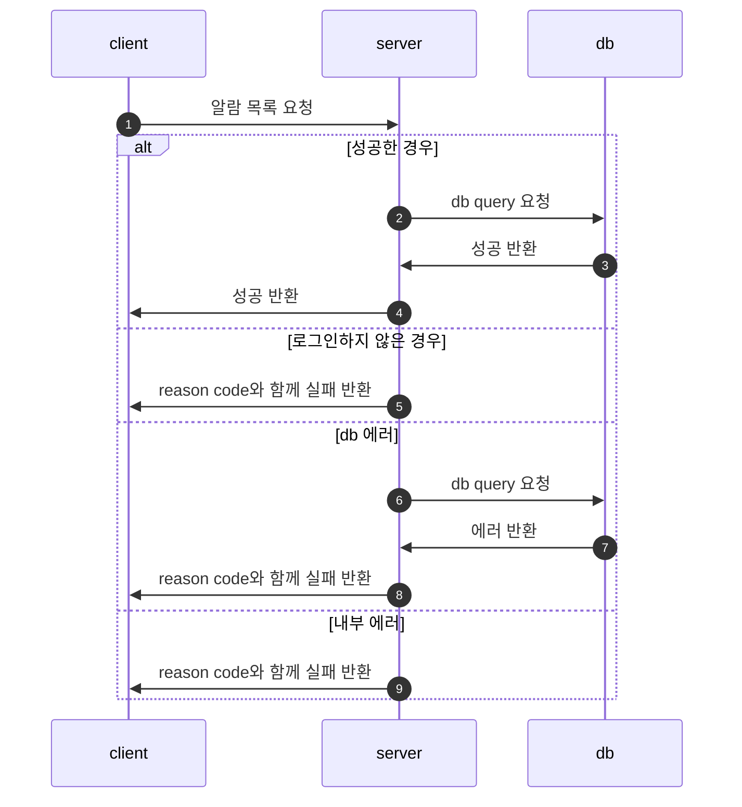

# SNS Project
이 프로젝트는 유저 간의 소셜 네트워크 서비스 기능을 제공하며, 회원가입, 로그인, 포스트 작성/수정/삭제, 피드 목록, 좋아요 및 댓글 기능을 구현합니다. 또한 알람 기능을 통해 실시간 알림을 받을 수 있도록 구성하였습니다. 대용량 트래픽을 처리할 수 있는 아키텍처와 Redis를 사용한 캐싱을 통해 성능 최적화를 구현하였습니다.

## 목차
1. [기술 스택](#기술-스택)
2. [요구사항 분석](#요구사항-분석)
3. [시스템 아키텍처](#시스템-아키텍처)
4. [주요 기능](#주요-기능)
5. [프로세스 흐름도](#프로세스-흐름도)

## 기술 스택
- Backend: Java 17, Spring Boot 2.6.7, Spring Data JPA, Spring Security
- Database: PostgreSQL, Redis (캐싱)
- Message Broker: Apache Kafka
- Build Tool: Gradle
- Testing: JUnit 5
- Deployment: Docker, Heroku
- Others: Lombok, GitHub (버전 관리), Server-Sent Events (SSE, 실시간 알림)

## 요구사항 분석
- 사용자 인증 및 인가 기능이 필요하며, JWT를 이용한 토큰 기반 인증 방식을 사용합니다.
- 사용자는 게시물을 작성하고 수정, 삭제할 수 있으며, 게시물에 댓글 및 좋아요를 추가할 수 있습니다.
- 알람 기능을 통해 게시물에 대한 상태 변화(좋아요, 댓글 등)를 실시간으로 확인할 수 있습니다.
- 모든 데이터를 Redis로 캐싱하여 데이터베이스 호출을 최소화하고 성능을 향상시킵니다.

## 시스템 아키텍처

## 주요 기능
- 회원가입 및 로그인: JWT 토큰 기반 인증 구현
- 포스트 CRUD: 게시물 생성, 수정, 삭제 및 피드 목록 조회 기능
- 좋아요 및 댓글: 게시물에 대한 좋아요 및 댓글 기능 구현
- 알람 기능: SSE(서버 전송 이벤트)를 사용한 실시간 알림
- Redis 캐싱: 데이터베이스 호출 횟수를 줄이기 위해 Redis를 사용하여 캐싱 구현
- Kafka: 비동기 이벤트 처리 및 시스템 간 데이터 동기화
  - 좋아요, 댓글 등의 사용자 활동을 이벤트로 발행
  - 실시간 알림 시스템에 이벤트 전달
  - 시스템 간 느슨한 결합 구현으로 확장성 및 장애 대응력 향상
- Spring Security: 인증 및 권한 관리

## 프로세스 흐름도

### 1. 회원가입

### 2. 로그인

### 3. 포스트 작성

### 4. 포스트 삭제

### 5. 포스트 수정

### 6. 피드 목록

### 7. 좋아요 기능

### 8. 댓글 기능

### 9. 알람 기능

